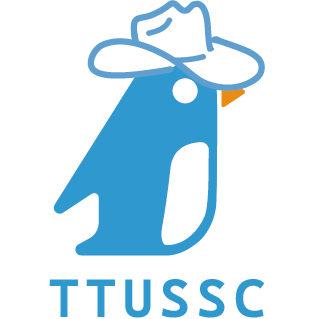

<p align="center">
  <a href="https://ttussc.github.io/11th">
    
  </a>
</p>

科學開源服務社自我佐證簡報，使用 [reveal.js](https://revealjs.com/) 製作。

## 相依軟體

- [git](https://git-scm.org)
- [node.js](https://nodejs.org/en)
- [npm](https://www.npmjs.com/)

## 使用此簡報

### 透過指令介面

```zsh
git clone https://github.com/TTUSSC/evaluate.git
npm install
npm start
```

### 簡易化下載(Windows)

[下載連結](https://github.com/TTUSSC/evaluate/archive/refs/heads/main.zip)
對 `install.ps1` 點擊右鍵，使用 [Power Shell](https://apps.microsoft.com/detail/9mz1snwt0n5d?launch=true&mode=full&hl=zh-tw&gl=tw&ocid=bingwebsearch) 執行此檔案。
